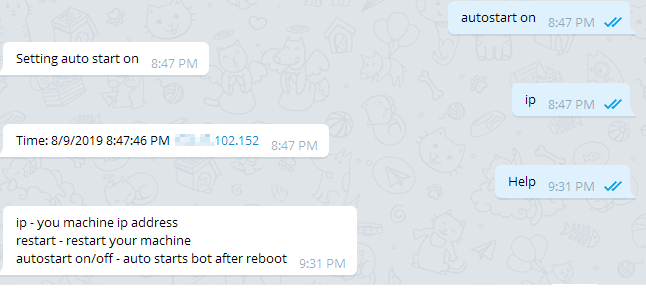

# Telegram Ping Bot

The program is a telegram bot client for Windows. It can provide a local IP address for the machine that is running on. This is useful for VPN connections when DNS is not propogated correctly, and you don't know where to RDP. The bot also can restart the machine.

Commands:

help - will list all bot commands
ip - will print IP address of the bot's host
restart - will restart host machine
autostart on - will set the program to autostart at boot time
autostart off - will disable autostart at boot time

The program hides in notification tray, where you can manually close it.

Use [BotFather](https://telegram.me/botfather) to create a telegram bot, then specify the newly create bot token in config file.

